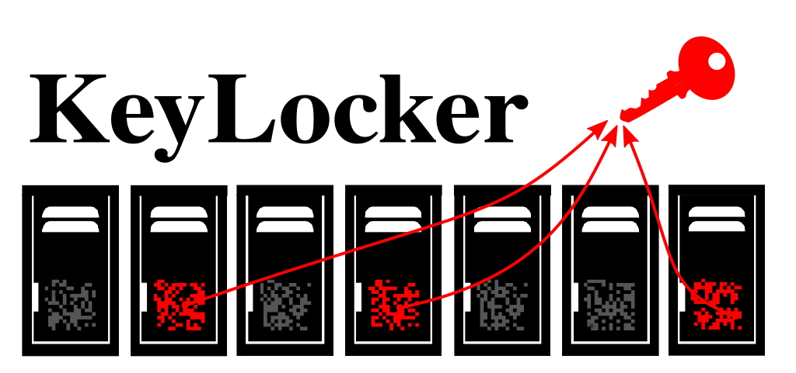
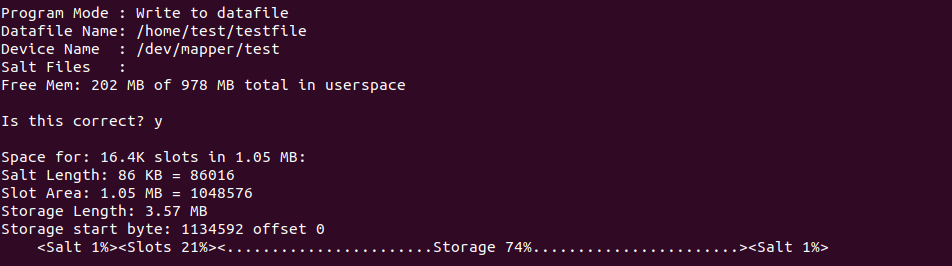
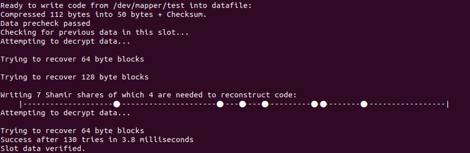
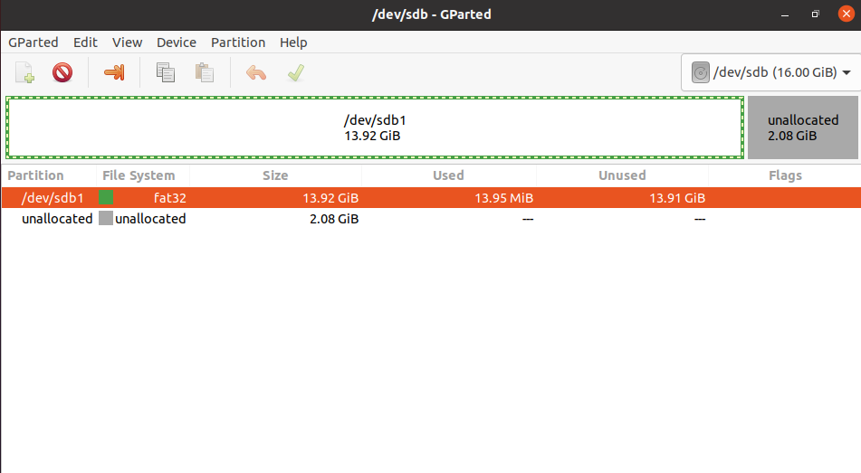



KeyLocker allows your to store the keys to an unknowable number of hidden partitions on an unknowable number of drives with no way to know how many keys it contains.

Without the password, the entire KeyLocker file appears as random data, but only after hashing your password through the memory expensive [Argon2 hashing algorithm](https://en.wikipedia.org/wiki/Argon2), can you recover one of these hidden keys. It does this by dividing a file (or hidden disk section) into a number of "shares."

By itself each share appears as random data, but by combining them with the [Shamir Secret Sharing](https://en.wikipedia.org/wiki/Shamir%27s_Secret_Sharing) method, and then decrypting it with the a key derived from your password, the data is revealed. This design means that that even if some of the shares are corrupted by other keys stored within the file, it will still be recoverable given that a certain minimum number is met.

However, uncovering one key tells you nothing about how many more keys are stored within the KeyLocker. Each key is derived from it's own hashed password. Even if you use the same password, it hashes the serial number of each drive to be unlocked so you could have the password to a hidden partition on one drive with no way to know if the same password would unlock the keys to additional drives.

----

# Features:

#### Hashing:

  * [Argon2 key derivation](https://en.wikipedia.org/wiki/Argon2) – By using a large amount of memory to hash keys this algorithm provides maximum resistance to GPU cracking attacks. This makes it exponentially more difficult to hack shorter passwords.
  * Passwords are never stored in strings, which would leave copies scattered across program memory. Only mutable type like Bytearrays are used to store sensitive data of each individual password keystroke. After creation, the password bytearray is hashed into Sha512() object and then instantly wiped with junk data.
  * Mouse hashing – By hashing mouse movements with the existing random number generator, the quality of the random data is enhanced.

#### KeyFile:

  * [Shamir Shares](https://en.wikipedia.org/wiki/Shamir%27s_Secret_Sharing) – make the key recoverable if multiple keys in the KeyLocker overwrite the same slot while saying nothing about how many keys ultimately exist.
  * Normal shares – Optionally you can disable shamir shares and just store normal shares where each one is encrypted with it’s own special key.
  * Hidden KeyFile - Store the KeyFile in the slack space between partitions or use a normal file.
  * Store multiple text segments securely. Use it as a password manager or whatever you wish. For example you could copy paste the domain name after typing in your password to retrieve a seperate unique password for each website.
  * Random KeyFile – There’s no way to prove that the KeyFile is truly a KeyLocker generated file or just random noise.
  * Built in [salt](https://en.wikipedia.org/wiki/Salt_(cryptography)) area at the beginning and end of each KeyFile. - SSDs don’t always delete every sector even if you try to directly overwrite the file. By hashing the SALT in with the password, it increases the chances that a deleted KeyFile will be truly irrecoverable.

#### Program Notes:

  * No binary blob - You don’t have to trust an opaque machine code executable, because there is none. The source code is 100% written in python so you can easily read and understand every step of how it works. This is why the second line disables the automatic bytecode (.pyc) file generation.
  * Open Source – The code for this project will always be 100% open so anyone can read and contribute to it.


----

# Usage Examples:

### Save the keys from an existing partition in the KeyFile

Let's say you have an existing encrypted /dev/mapper partition that you want to save the keys from:

```
  sudo ./keylocker.py ~/testfile /dev/mapper/test
```

In write mode, the partition data and keys in this example are compressed from 112 bytes to 50 bytes plus a checksum so it fits neatly within a shingle share. Because KeyLocker is storing the partition boundaries, this does not have to be a defined partition in the MBR. It can be any hidden encrypted area anywhere on the disk.



The share is stored within the slots portion of the testfile. Each share is 64 bytes long, but can be extended to double size to hold larger data segments. Each share is encrypted seperately with it’s own unique password derived from your Argon2 password hash.



In this example, 7 shamir shares are created, represented by their position in the KeyFile with dots on the dotted line. Each individual shamir share is encrypted so it appears as random data. 4 of these can be combined to form the original key, so if another key should happen to overwrite some of the 7 shares, the key can still be reconstructed. However, therere is no way to know how many valid shares were originally created.

### Create a hidden volume within a partition or drive



**Warning! Using KeyLocker in this way is very dangerous as its very easy to accidentally overwrite an existing partition or data. _ALWAYS_ make a full backup of any computer before creating hidden partitions with --create**

----

Without arguments `--create` uses the entire drive:

```
  sudo ./args.py ~/testfile /dev/sdb1 test --create
```

Let’s say you want to hide an encrypted partition within the last 2 gigabytes of a Fat32 or NTFS partition like so:

```
  sudo ./keylocker.py ~/testfile /dev/sdb test --create='-2G 1M'
```

which will create a a hidden encrypted area starting at 2 gigabytes before the end of the drive and use the remainder up until the last megabyte. The information for the partition boundaries are then stored withing a slot of the KeyFile that is encrypted with your password. This is of course a great way to lose data should someone start writing random files to said NTFS drive. Make backups!


### Create a hidden partition in the free space of a drive

Let's say you have to free space at the end of the drive `/dev/sda` that you wish to convert into a hidden partition. To make sure the entire free space is used without overlap you can type:

```
  sudo ./keylocker.py ~/testfile /dev/sdb --create='/dev/sdb1+1M'
```

which will create a hidden partition starting at 1 megabyte after the end of /dev/sdb1 and ending 1 megabyte before the end of the drive.

### Hiding the KeyFiley

Finally to hide the KeyFile itself, you can embed it within the MBR partition table like so:

```
  sudo ./keylocker.py /dev/sdb /dev/sdb --create='/dev/sdb1+1M -1M'
```

which will use sectors: 128 to 2047 for the KeyFile and put a hidden partition in the free space of /dev/sdb - Please verify these sectors are empty before use as this has not been tested yet on multiple systems.

----

# Installation:

To install pip and required python tools:


```
  sudo apt update
  sudo apt install python3-distutils python3-setuptools python3-dev gcc
  pip3 --version || sudo python3 -m easy_install install pip

```

The following pip modules are required for use:

  * [Readchar](https://pypi.org/project/readchar/) - For password entry
  * [Argon2](https://pypi.org/project/argon2/) - For memory intensive password hashing
  * [Psutil](https://pypi.org/project/psutil/) - To get system memory stats
  * [Crypto](https://pypi.org/project/crypto/) - To do the [AES encryption](https://en.wikipedia.org/wiki/Advanced_Encryption_Standard)
  * [Xlib](https://pypi.org/project/xlib/) - (optional) To find the mouse pointer position for hash_mouse.py

You can get them by running `pip` like so:

```
  sudo python3 -m pip install setuptools argon2 readchar xlib psutil pycrypto
```

# Usage:

```
  ./keylocker.py <keyfile> <device_name> --options...
```

Get detailed help with: `./keylocker.py -h`


# Contribution:

Let me know if you would like to see a GUI version or any additional features requests! If anyone want to contribute to a working Windows version, feel free to join the project.

### Todo:

 - [ ] GUI Interface
 - [ ] Data storage area inside larger KeyFiles
 - [ ] Make it work with LUKS devices.
 - [ ] Windows Compatibility


----

# Disclaimer:

THERE IS NO WARRANTY FOR THE PROGRAM, TO THE EXTENT PERMITTED BY APPLICABLE LAW. EXCEPT WHEN OTHERWISE STATED IN WRITING THE COPYRIGHT HOLDERS AND/OR OTHER PARTIES PROVIDE THE PROGRAM "AS IS" WITHOUT WARRANTY OF ANY KIND, EITHER EXPRESSED OR IMPLIED, INCLUDING, BUT NOT LIMITED TO, THE IMPLIED WARRANTIES OF MERCHANTABILITY AND FITNESS FOR A PARTICULAR PURPOSE. THE ENTIRE RISK AS TO THE QUALITY AND PERFORMANCE OF THE PROGRAM IS WITH YOU. SHOULD THE PROGRAM PROVE DEFECTIVE, YOU ASSUME THE COST OF ALL NECESSARY SERVICING, REPAIR OR CORRECTION.

IN NO EVENT UNLESS REQUIRED BY APPLICABLE LAW OR AGREED TO IN WRITING WILL ANY COPYRIGHT HOLDER, OR ANY OTHER PARTY WHO MAY MODIFY AND/OR REDISTRIBUTE THE PROGRAM AS PERMITTED ABOVE, BE LIABLE TO YOU FOR DAMAGES, INCLUDING ANY GENERAL, SPECIAL, INCIDENTAL OR CONSEQUENTIAL DAMAGES ARISING OUT OF THE USE OR INABILITY TO USE THE PROGRAM (INCLUDING BUT NOT LIMITED TO LOSS OF DATA OR DATA BEING RENDERED INACCURATE OR LOSSES SUSTAINED BY YOU OR THIRD PARTIES OR A FAILURE OF THE PROGRAM TO OPERATE WITH ANY OTHER PROGRAMS), EVEN IF SUCH HOLDER OR OTHER PARTY HAS BEEN ADVISED OF THE POSSIBILITY OF SUCH DAMAGES.
